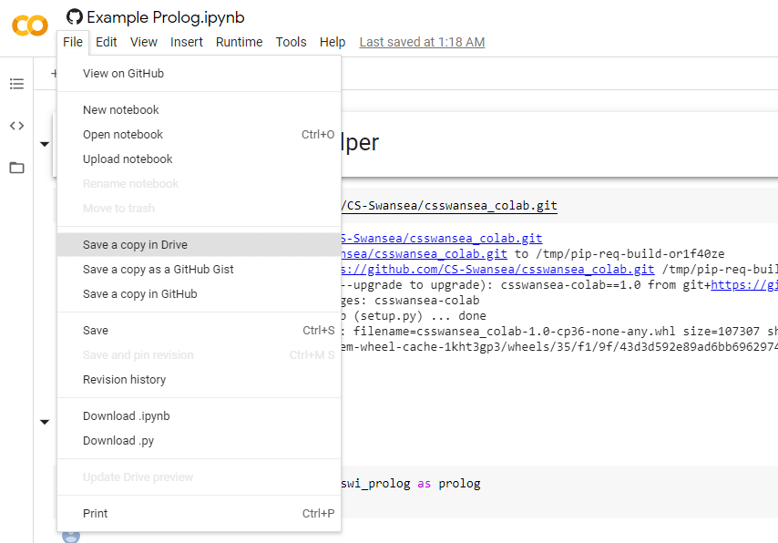

# csswansea_colab

Resources for Configuring Programming Environments in Google Colab
 
1. Go to https://colab.research.google.com/ and use the `Open Notebook` option to bring up the open dialog. 

2. Use the `Github` tab of the open dialog and search for `CS-Swansea`. 

3. Select the example notebook for the language you plan on using.

4. Create a duplicate of the example stored on your Google Drive.

